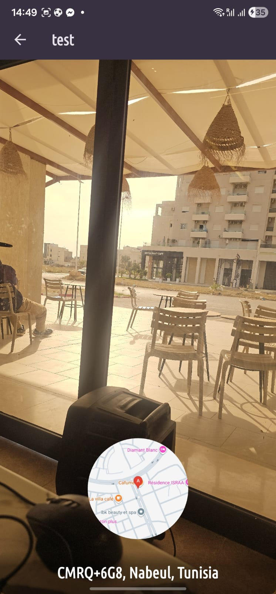

# 📍 Favourite Places App

A beautiful and feature-rich Flutter application that allows users to capture, store, and manage their favorite places with photos, locations, and interactive maps.

## ✨ Features

### 🖼️ Image Management
- **Camera Integration**: Capture high-quality photos directly from the camera
- **Gallery Picker**: Select existing photos from the device gallery
- **Full Resolution**: Preserves original image quality without compression
- **EXIF Metadata**: Maintains photo orientation and metadata
- **Smart Preview**: High-quality image rendering with filterQuality optimization

### 📍 Location Services
- **GPS Integration**: Get current location with precise coordinates
- **Permission Handling**: Intelligent runtime permission requests
- **Service Detection**: Automatic location service availability checks
- **Address Geocoding**: Convert coordinates to human-readable addresses
- **Location Preview**: Display picked location with coordinates

### 🗺️ Interactive Maps
- **Google Maps Integration**: Full Google Maps SDK implementation
- **Interactive Selection**: Tap to pick locations on the map
- **Fixed Markers**: View-only mode for saved places
- **Dual Mode**: Selection mode for picking and view mode for displaying
- **Camera Controls**: Smooth camera positioning and zoom controls
- **Custom Markers**: Visual indicators for saved locations

### 💾 Data Persistence
- **SQLite Database**: Local storage using sqflite package
- **Async Loading**: Non-blocking data retrieval with FutureBuilder
- **CRUD Operations**: Complete Create, Read, Update, Delete functionality
- **File Storage**: Efficient image file management
- **State Management**: Riverpod for reactive state handling

### 🎨 User Interface
- **Dark Theme**: Modern dark mode color scheme
- **Material Design 3**: Latest Material Design guidelines
- **Custom Fonts**: Google Fonts (Ubuntu Condensed) integration
- **Responsive Layouts**: Adaptive UI for different screen sizes
- **Smooth Animations**: Flutter's animation framework
- **Loading States**: Progress indicators for async operations
- **Empty States**: Helpful messages when no data exists

## 🛠️ Technologies & Packages

### Core Framework
- **Flutter SDK**: Cross-platform mobile app development
- **Dart**: Programming language

### State Management
- **flutter_riverpod** (^3.0.3): Reactive state management and dependency injection

### Location & Maps
- **google_maps_flutter**: Google Maps widget integration
- **google_maps_flutter_android**: Android-specific Maps implementation
- **google_maps_flutter_platform_interface**: Platform interface for Maps
- **location** (^8.0.1): GPS and location services

### Image Handling
- **image_picker** (^1.2.0): Camera and gallery access
- **flutter_plugin_android_lifecycle**: Android lifecycle management for plugins

### Data Persistence
- **sqflite**: SQLite database for local storage
- **path_provider**: Access to device file system paths
- **path**: File path manipulation utilities

### UI & Fonts
- **google_fonts** (^6.3.2): Custom typography
- **uuid** (^4.5.2): Unique identifier generation

### Development Tools
- **flutter_lints** (^5.0.0): Dart code analysis and linting

## 🏗️ Architecture

### Project Structure
```
lib/
├── main.dart                 # App entry point & theme configuration
├── models/
│   └── place.dart           # Place data model with location
├── providers/
│   └── user_places.dart     # Riverpod state management
├── screens/
│   ├── places.dart          # Main places list screen
│   ├── add_place.dart       # Add new place form
│   ├── place_detail.dart    # Place details with map preview
│   └── map.dart             # Full-screen interactive map
└── widgets/
    ├── places_list.dart     # Reusable places list widget
    ├── image_input.dart     # Camera/gallery picker widget
    └── location_input.dart  # Location picker widget
```

### Design Patterns
- **Provider Pattern**: Riverpod for state management
- **Repository Pattern**: Abstracted data access layer
- **Widget Composition**: Reusable, modular UI components
- **Async/Await**: Modern asynchronous programming
- **FutureBuilder**: Reactive UI updates for async operations

## 🚀 Getting Started

### Prerequisites
- Flutter SDK (3.8.1 or higher)
- Dart SDK (included with Flutter)
- Android Studio / Xcode for platform-specific builds
- Google Maps API key

### Installation

1. **Clone the repository**
   ```bash
   git clone <repository-url>
   cd favourite_places_app
   ```

2. **Install dependencies**
   ```bash
   flutter pub get
   ```

3. **Configure Google Maps API**
   
   **Android:**
   - Add your API key to `android/local.properties`:
     ```
     MAPS_API_KEY=YOUR_API_KEY_HERE
     ```
   
   **iOS:**
   - Add to `ios/Runner/Info.plist`:
     ```xml
     <key>GMSApiKey</key>
    <string>YOUR_API_KEY_HERE</string>
     ```

4. **Run the app**
   ```bash
   flutter run
   ```

### Platform-Specific Setup

#### Android
- Minimum SDK: Set by Flutter (check `android/app/build.gradle.kts`)
- NDK Version: 27.0.12077973
- Permissions automatically handled:
  - `INTERNET`
  - `ACCESS_NETWORK_STATE`
  - `ACCESS_COARSE_LOCATION`
  - `ACCESS_FINE_LOCATION`

#### iOS
- iOS 12.0 or higher
- Info.plist permissions already configured:
  - `NSPhotoLibraryUsageDescription`
  - `NSCameraUsageDescription`
  - `NSLocationWhenInUseUsageDescription`

## 📱 How to Use

1. **Add a Place**
   - Tap the `+` button in the app bar
   - Enter a title for your place
   - Choose image source (Camera or Gallery)
   - Capture/select a photo
   - Tap "Get Current Location" to add GPS coordinates
   - Or tap "Select on Map" to pick a location manually
   - Press "Add Place" to save

2. **View Places**
   - Browse your saved places in the main list
   - Tap any place to see full details

3. **Place Details**
   - View high-resolution photo
   - See address and coordinates
   - Tap the map preview to open full interactive map

4. **Interactive Map**
   - Pan and zoom to explore
   - View fixed marker for saved places
   - In selection mode: tap to pick a new location

## 🔐 Security & Privacy

- API keys stored in gitignored files (`local.properties`)
- No sensitive data committed to version control
- Runtime permission requests for camera and location
- User consent required for all data access
- Local-only data storage (no cloud sync)

## 🎯 Future Enhancements

- [ ] Place categories and tags
- [ ] Search and filter functionality
- [ ] Cloud backup and sync
- [ ] Share places with friends
- [ ] Multiple photos per place
- [ ] Route planning between places
- [ ] Offline map caching
- [ ] Place notes and descriptions
- [ ] Export/import functionality

## 🤝 Contributing

Contributions are welcome! Please feel free to submit a Pull Request.

## 📄 License

This project is licensed under the MIT License - see the LICENSE file for details.

## 👨‍💻 Developer

Built with ❤️ using Flutter

## 🙏 Acknowledgments

- Google Maps Platform for mapping services
- Flutter team for the amazing framework
- Riverpod for elegant state management
- All open-source contributors

---

**Note**: Remember to keep your API keys secure and never commit them to public repositories!

## 📸 Screenshots

<p align="center">
  
  
</p>
